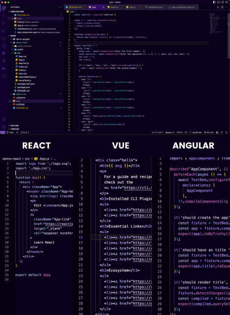
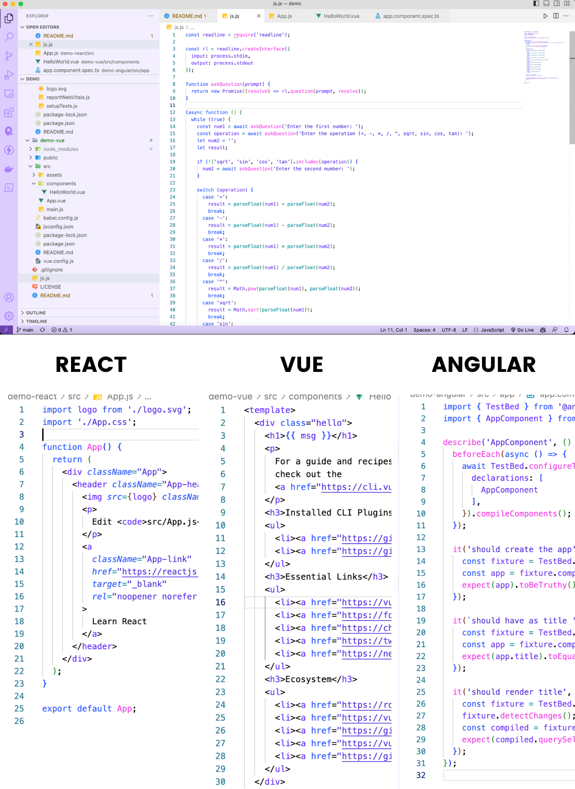

# Lunar

## A minimalist VS Code theme that makes your code shine like the moon

Lunar Theme is a minimalist VS Code theme that's perfect for those who appreciate simplicity and a clean, uncluttered workspace. The theme is designed to make your code shine like the moon, with subtle shades of purple and blue that create a calming, soothing atmosphere.

**Please give this repo a ⭐ it really helps us!**

Website: [lunar.devarshi.dev](https://lunar.devarshi.dev)

### Lunar Dark Theme

### Lunar Light Theme

## Installation

1.  Install [Visual Studio Code](https://code.visualstudio.com/)
2.  Launch Visual Studio Code
3.  Choose **Extensions** from menu
4.  Search for `lunar vscode theme`
5.  Click **Install** to install it with the publisher name as **PrismLink**.
6.  Click **Reload** to reload the Code
7.  From the menu bar click: Code > Preferences > Color Theme > **Lunar Theme**

## Alternatives

- [Lunar VSCode Theme from VSCode Marketplace](https://marketplace.visualstudio.com/items?itemName=PrismLink.lunar-theme)
- [Lunar VSCode Theme for VSCodium](https://open-vsx.org/extension/PrismLink/lunar-theme)
- [Lunar Theme for Neovim](https://github.com/prismlinkapp/lunar.nvim)
- Lunar Theme for Zed - Coming Soon

## Feedback

If you have any feedback, please reach out to us [here](https://bio.link/devarshishimpi)
